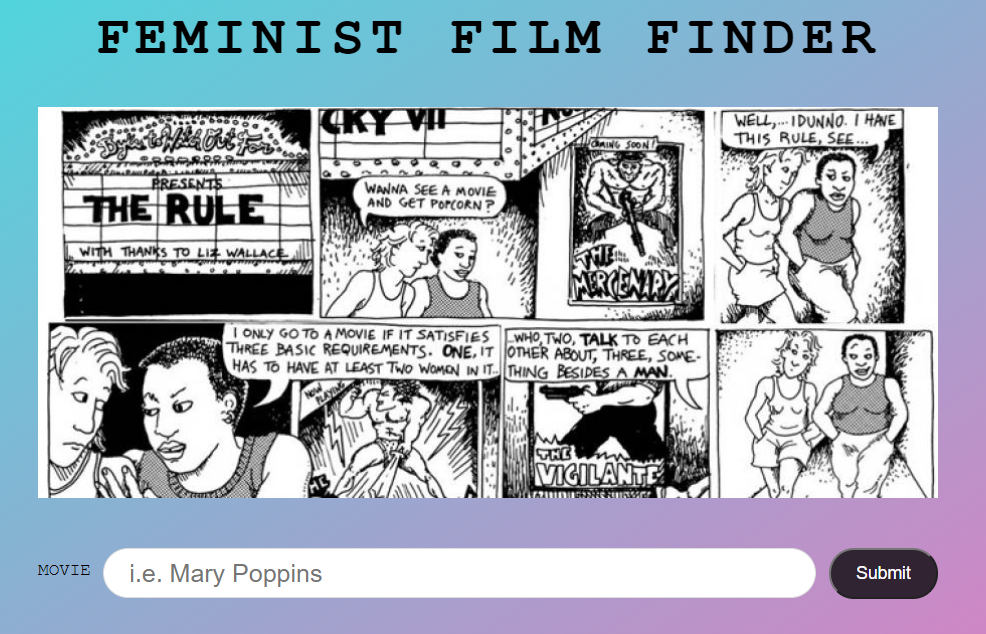

# FeministFilmFinder
The Feminist Film Finder is a ReactJS project designed to inform users whether the movie they searched for passes the Bechdel Test. 

## About the Bechdel Test
The Bechdel Test is a simple test which checks a movie for the following three criteria: 
* (1) it has to have at least two women in it, 
* who (2) who talk to each other, 
* about (3) something besides a man.
 
 Find more information <a href="https://bechdeltest.com/" target="_top">here</a>.

## Overview
Features of this site include: 
* A movie search engine that returns whether a given movie passes the Bechdel test, indicating whether it is woman inclusive.
* Utilizes CORS Anywhere API for cross-origin requests.
* Consumes and integrates data from two different APIs 

## Project snapshot

Demo: https://lorenmora.github.io/FeministFilmFinder/

### APIs
<a href="https://bechdeltest.com/api/v1/doc" target="_top">Bechdel Test API</a>
<a href="https://developers.themoviedb.org/3/getting-started/introduction" target="_top">The Movie Database API</a>
